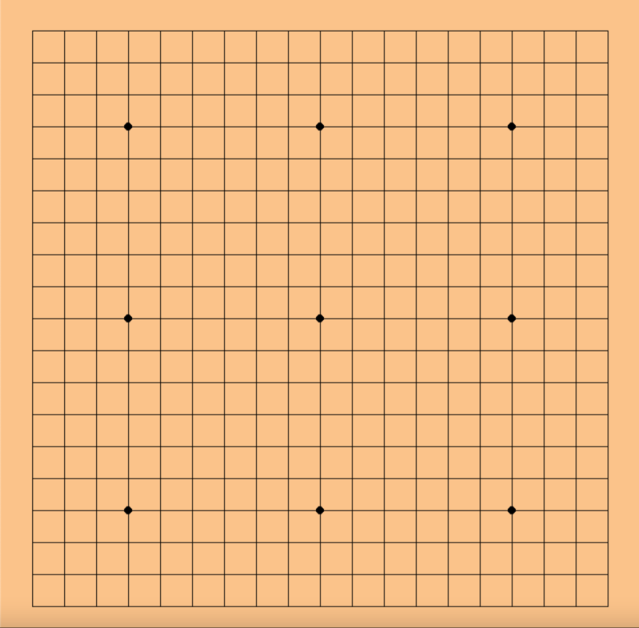
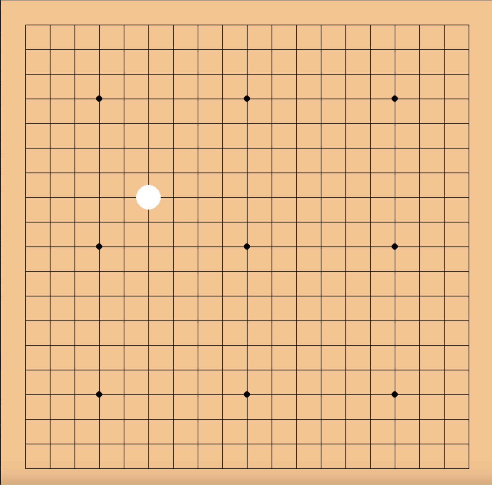
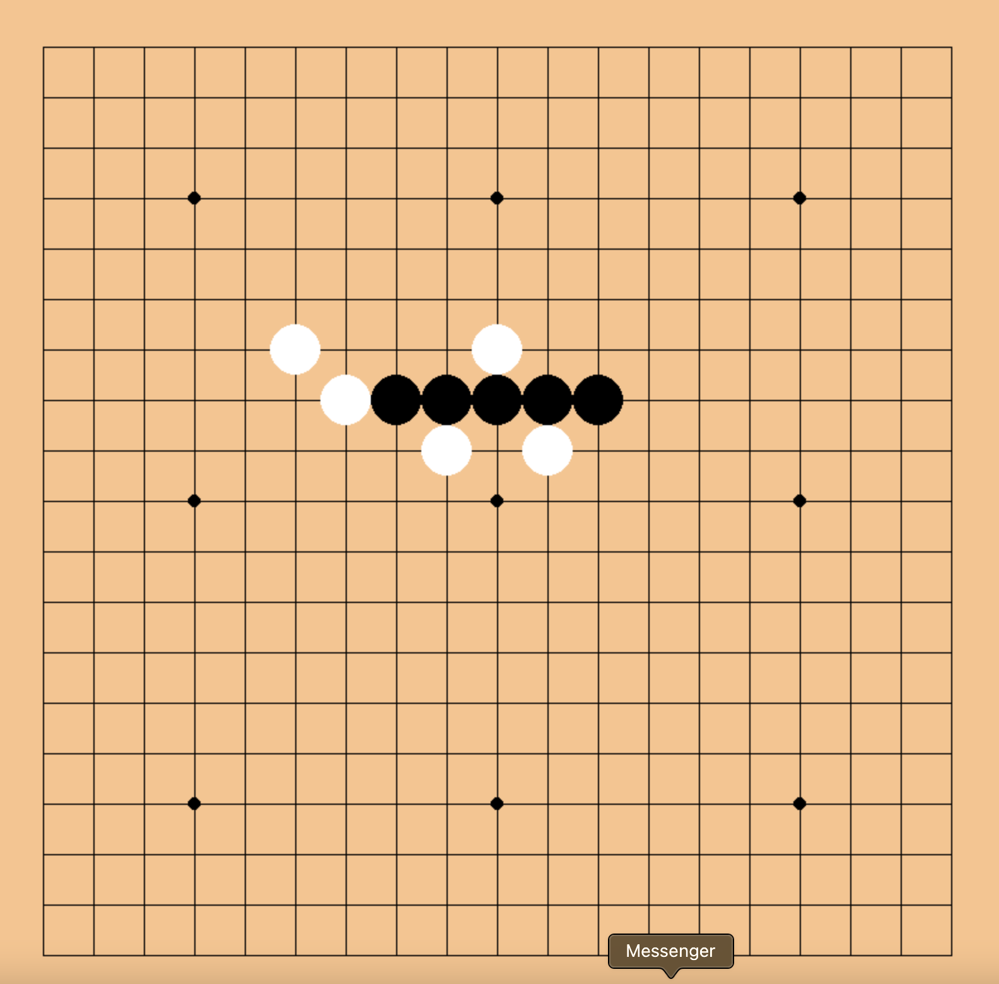
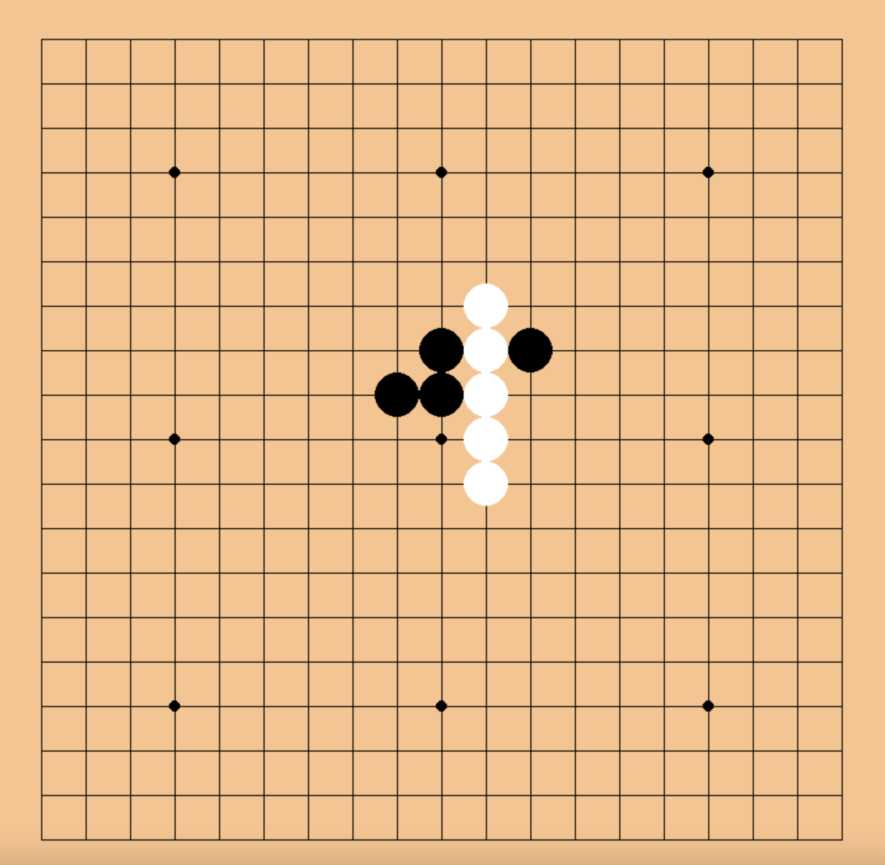
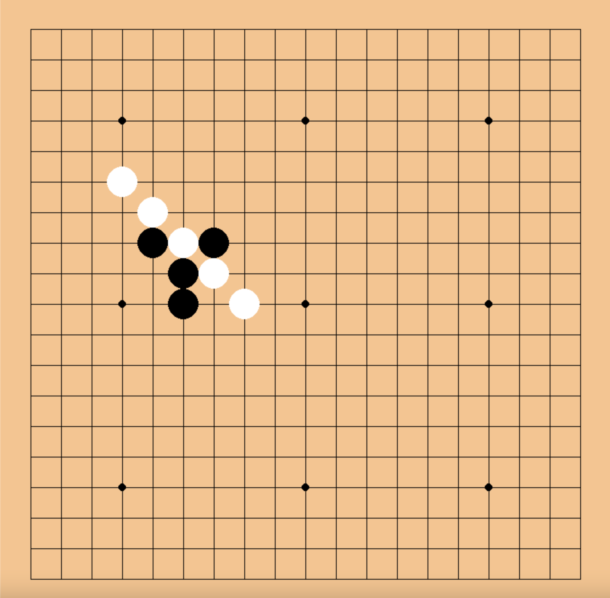

#Align-Five

## Introduction
This is a two player game, where the users play 
either black or white stones. The objective of the game
is to align 5 stones of the same colour in one row,
column or across a diagonal. Players take alternating
turns to place their stones on the board.
The game is played on a 19 x 19 Go board.

### Getting started with the package
To get started with this package, clone the repo
```bash
git clone https://github.com/mwolinska/Align-Five
```
Then make sure you are in teh right folder
```bash
cd Align-Five
```

Then set up and activate teh virtual environment
```bash
python3 -m venv ./venv
source venv/bin/activate
```

### Using the package
An example run would look like this.

First, a clean board is displayed. 


The first move is made by the user playing white. 


Then the users alternate to play their moves until one of 
the four outcomes is achieved
* 5 stones of one colour are aligned in a row

* 5 stones of one colour are aligned in a column

* 5 stones of one colour are aligned across a diagonal

* All the moves on the board have been taken and the 
game is a draw